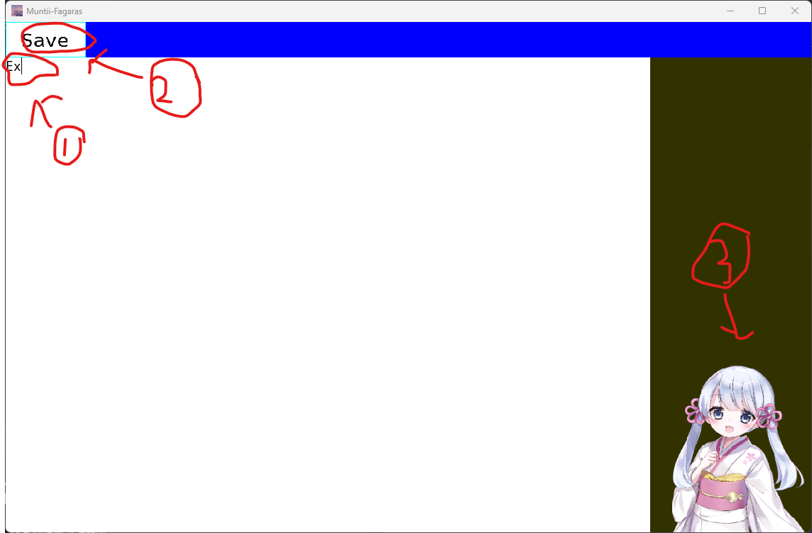

# メイン画面

## テキスト入力(1)

メイン画面上の**1**で囲まれている部分にはテキストを入力することができます。マウスカーソルをテキスト入力部にフォーカスし、キーボードから任意の文字列を入力してください。

## テキスト入力内容の保存(2)

メイン画面上の**2**で囲まれている**Save**は入力されたテキストをファイルへ保存するボタンです。
プログラムが含まれている同一ディレクトリに**default.txt**という名前で入力されたテキストが保存されます。

## つくよみちゃん(3)

メイン画面上の**3**で囲まれているつくよみちゃんをクリックすると、つくよみちゃんがおしゃべりしてくれます。